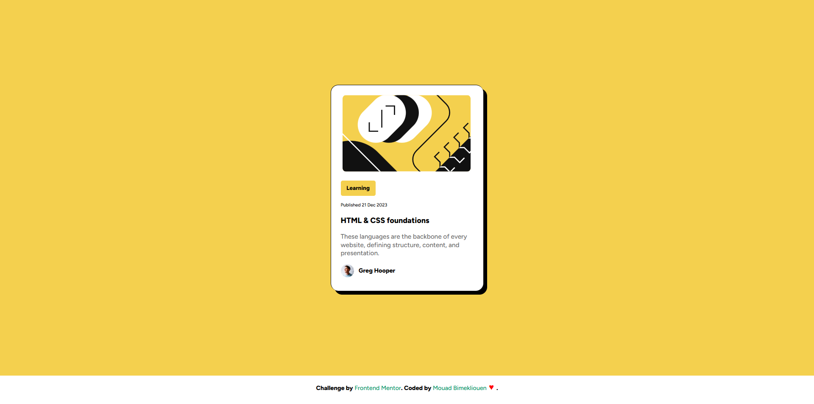

<h1>Blog Card Preview</h1>

This project is a simple QR code generator implemented on a website front-end. The goal was to create a clean, user-friendly page where visitors can input a URL or text, and instantly generate a corresponding QR code. The project challenge focuses on simplicity, ensuring that the page is responsive and intuitive, with a smooth user experience.

 

